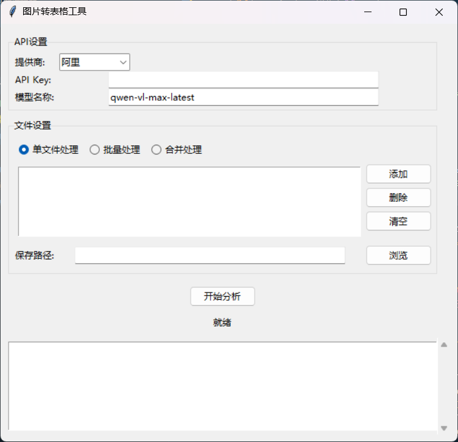

# PictureTransferForm 📸➡️📊

通过大模型分析图片，自动转换为 Excel 表格，帮你轻松提取图片中的数据信息！

## 功能 ✨

- 支持单文件、批量以及合并处理模式
- 自动识别图片中包含的表格或数据信息
- 根据图片内容生成标准 JSON 数据，确保数据完整性
- 自动应用格式建议，生成美观的 Excel 表格

## 使用方法 🚀

1. 请确保你已安装所需的依赖库，如 `openpyxl`、`openai` 等。
2. 在配置文件 [`config.json`](./config.json) 中填写你的 API Key 和对应的模型参数。
3. 运行 `gui.py` 文件，启动图形化界面。
4. 根据需要选择单文件、批量或合并处理模式，再选择或添加图片。
5. 设置好 Excel 的保存路径后，点击“开始分析”按钮，等待处理完成。
6. 分析完成后，程序将自动保存生成的 Excel 表格。

## 注意事项 ⚠️

- 请在使用前访问以下网址申请 API Key：
  - 阿里云 API： [https://bailian.console.aliyun.com/](https://bailian.console.aliyun.com/) 🌐
  - 火山引擎 API： [https://www.volcengine.com](https://www.volcengine.com) 🌐
- 确保网络连接稳定，避免因请求超时导致分析失败。
- 程序默认对返回的数据进行 JSON 格式解析，如遇格式问题，可尝试降低请求温度或根据提示调整参数。

## 许可协议 📄

本工具采用[MIT](https://github.com/Cheng-MaoMao/PictureTransferForm?tab=MIT-1-ov-file#readme)许可证，仅用于学习和交流，使用过程中请确保遵循相关 API 服务商的使用规定。
若出现任何个人利益损害或数据泄露与作者本人无关。
